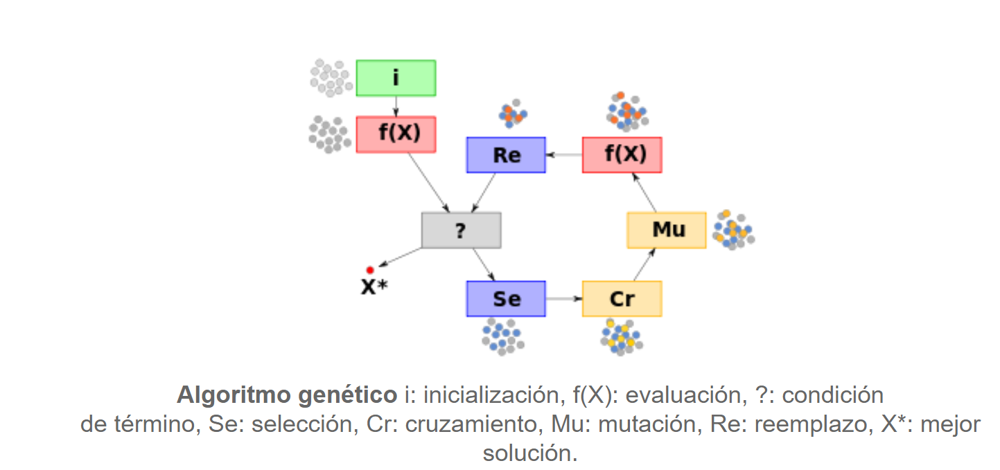

Problema de las n reinas, en este caso 
se planteo una solucion para n=8,
Algoritmo

- Inicio:
  generar aleatoreamente n (cromosomas)
- Funcion de aptitud:
  evaluar f(x) para cada cromosoma x en la poblacion
- Descendencia:
  Crear nueva poblacion
  - seleccion
  - cruzamiento
  - aceptacion
- Reemplazo: usar la descendencia y probar si es una soolucion optima
  y regresar al paso 2

La solucion esta basada en [guia solucion al problema de las n reinas](https://pythondiario.com/2018/05/el-problema-de-las-n-reinas-algoritmos.html]Algoritmo)
 (sin usar la parte de las mutaciones)
